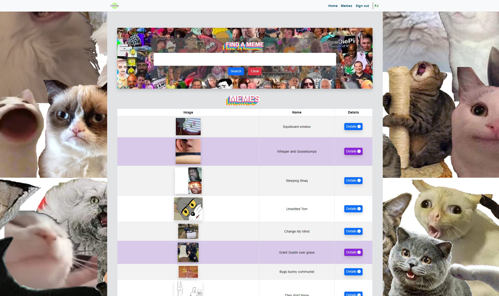

# Find A Meme



This meme-sharing application is built using Node.js and Express. It allows users to view and interact with memes from an external API, using session-based authentication via passport.js and renders dynamic HTML using EJS.

## Installation

1. Clone the repository

   ```bash
   git clone https://github.com/noroff-backend-1/mar24ft-jss-ca-1-Anclagen.git
   cd mar24ft-jss-ca-1-Anclagen
   ```

2. Install the dependencies

   ```bash
   npm install
   ```

3. Ensure Node.js version 18.12.0 or later is installed.
4. Create a `.env` file in the root directory and add the following:

   ```env
   PORT=3000
   SESSION_SECRET=secret
   API_URL=http://jss.restapi.co.za/memes
   ```

   - These values will be used to set the port, session secret, and API URL respectively.

5. Start the server

- Production mode

  ```bash
  npm start
  ```

- Development mode

  ```bash
  npm run dev
  ```

6. Navigate to `http://localhost:3000` in your browser to view the application.

## Usage

Once the app is running, you can:

- Browse a list of memes from the external API.
- Search for memes by name.
- Log in to allow viewing details of a meme.
- Currently, the following users are available:
  - Josh (password: Josh1)
  - FJ (password: FJ1)
  - Student (password: Student1)
- View memes will be stored in the session and highlighted in the meme table.

The server will fetch meme data at startup and store it in memory, refreshing only when the server restarts.

## Dependencies

- node.js: ^18.12.0 (supports --watch and --env-file flags)
- express: ^4.18.2 (provides built-in body parsers via express.json() and express.urlencoded())
- express-session
- express-session-json
- cookie-parser
- http-errors
- axios
- passport
- passport-local
- bootstrap
- bootstrap-icons
- jquery
- ejs

## Tasks

### General

- Navbar should include:
- [x] The central logo
- [x] Redirect to the Memes Overview page when the navbar brand (logo) is clicked.
- [x] A login or logout button depending on the user's current state.
- [x] The current username, using "Guest" if not logged in.
- [x] Ensure the navbar appears on both the Meme Overview and Meme Details pages.
- [x] Passport.js should be used for session management.
- [x] Store information about the currently logged-in user using sessions.

### Meme Overview Page

- [x] API call should be made once, with 20 results stored in object when initially loading the page.
- [x] These result should persist even after navigating and then returning to the page.
- [x] Only when the web app is closed, the server is restarted, and the web app is reopened should a new singular API call be made, storing the new results in the object again.
- [x] API URL (http://jss.restapi.co.za/memes) should be stored in a environment file

-[x] Meme Table (On the overview page)

- [x] Small image 20% of the images original size
- [x] Name of the meme
- [x] Details button leading to the meme details page
- [x] Guest users should not be able to see the details button
- [x] For row where the details button has been clicked they should be highlighted in a different color to show they have been visited. (This should persist even after refreshing or navigating away from the page and returning)

- Search Functionality(On the overview page)

- [x] The search functionality should be done in the back-end and not the front-end.
- [x] The search should be done on the name of the meme.
- [x] The user should input the search term in a text box and click a search button to search.
- [x] The search results should be displayed in the existing table.
- [x] When the input is cleared, the table should return to its original state.

### Meme Details Page

-The meme details page should be accessible by clicking the details button on the meme table on the overview page and include the following:

- ID
- URL
- Image
- Name
- Dimensions (width, height)
- [x] If a Guest user enters the URL of a meme to access the details for that meme, they would need to be redirected to the login page.

### Login Page

- [x] The login page should include a form with the following fields:
- [x] Username
- [x] Password
